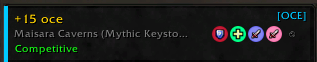

# OCEGroupFinder

A World of Warcraft addon that visually identifies premade group listings in the **Group Finder** (LFG List) that are led by players on **Oceanic (OCE) realms**.

Disclaimer: I vibe coded this with Claude just to see if I could, but I made sure to get my grubby mits in there and fix it how I wanted. (Take this however you will)

---

## Features



- Cyan `[OCE]` badge on results whose leader is from an OCE realm

- Toggleable colored left border on OCE group cards for quick scanning

- UI to add/remove realms at your own discretion

---

## Installation

1. Download or clone this repository.

2. Copy the `OCEGroupFinder` folder into:

```

World of Warcraft\_retail_\Interface\AddOns\

```

3. Launch (or reload) the game and enable the addon in the **AddOns** menu on the character select screen.

---

## Tracked OCE Realms

| Realm       |
| ----------- |
| Barthilas   |
| Caelestrasz |
| Dath'Remar  |
| Dreadmaul   |
| Frostmourne |
| Gundrak     |
| Jubei'Thos  |
| Khaz'goroth |
| Nagrand     |
| Saurfang    |
| Thaurissan  |

---

## Slash Commands

| Command  | Description |
| -------- | ----------- |
| `/ocegf` | Show help   |

| `/ocegf config` | Open the settings & realm editor pane |

| `/ocegf realms` | Print all tracked OCE realms to chat |

---

## How It Works (according to Claude)

The addon hooks into the **LFG List** UI:

1.  **`C_LFGList.GetSearchResultInfo(resultID)`** is called for every visible result card.

2.  The `leaderName` field (formatted as `"Name-Realm"`) is parsed to extract the realm.

3.  The realm is checked against the known OCE realm list.

4.  Matching cards receive a cyan `[OCE]` label, a coloured left border, and an enriched tooltip.

The hooks fire on `LFG_LIST_SEARCH_RESULTS_RECEIVED` and `LFG_LIST_AVAILABILITY_UPDATE`, so the UI updates automatically as you search or filter.

---

## Compatibility

- **Retail WoW** (Interface 12.0.5 / Midnight)

- No dependencies

---

## Contributing

Feel free top open up an issue, or yell at me when I'm live on [Twitch](https://twitch.tv/zarroe)

---

## License

MIT
